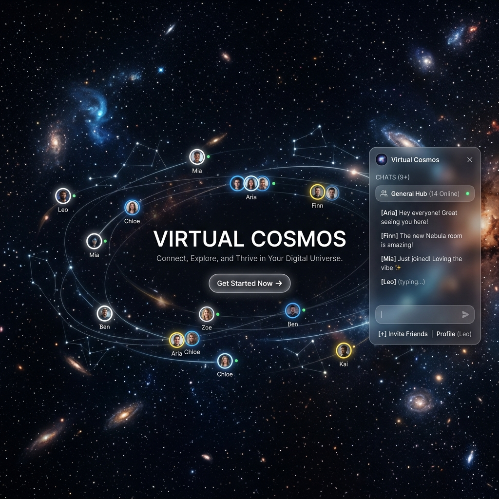

# 🌌 Virtual Cosmos

[](https://opensource.org/licenses/MIT)
[](https://reactjs.org/)
[](https://pixijs.com/)
[](https://socket.io/)
[](https://tailwindcss.com/)

**Virtual Cosmos** is a premium, real-time 2D virtual meeting space where social interaction is driven by proximity. Navigate a shared cosmic canvas, and instantly connect with others simply by walking up to them.



---

## ✨ Core Features

- **Proximity-Based Chat**: Integrated chat sessions automatically open when users are within 150px of each other, mirroring natural social dynamics.
- **Dynamic 2D Canvas**: High-performance rendering using **PixiJS v8** with a 1200x700px shared environment.
- **Cosmic Aesthetics**: A dark, premium theme featuring a **flickering starfield**, glassmorphism UI, and glowing proximity indicators.
- **Real-Time Multiplayer**: Seamless synchronization of movement and messages powered by **Socket.IO**.
- **Interactive UI**: Stylish glassmorphism panels for chat, identity setup, and system notifications (toasts).
- **Hysteresis Logic**: Smooth connection transitions with a 20px buffer to prevent UI flickering.

---

## 🚀 Getting Started

### Prerequisites
- Node.js (v18+)
- npm or yarn

### Installation

1. **Clone the repository**:
   ```bash
   git clone https://github.com/Kaifkhurshid7/Virtual-Cosmos.git
   cd Virtual-Cosmos
   ```

2. **Setup the Backend (Server)**:
   ```bash
   cd server
   npm install
   npm run dev
   ```
   *The server will run on `http://localhost:3001`.*

3. **Setup the Frontend (Client)**:
   Open a new terminal:
   ```bash
   cd client
   npm install
   npm run dev
   ```
   *The client will run on `http://localhost:5173`.*

---

## 🛠️ Technical Stack

| Category | Technology |
| :--- | :--- |
| **Frontend** | React 19, Vite, PixiJS v8, Zustand, Framer Motion |
| **Styling** | Tailwind CSS v4 (PostCSS/Vite) |
| **Backend** | Node.js, Express, Socket.IO |
| **Language** | TypeScript (Shared types for fullstack safety) |
| **Real-time** | WebSockets (Socket.IO) |

---

## 📁 Project Structure

```text
Virtual-Cosmos/
├── client/           # React + Vite + PixiJS Frontend
│   ├── src/
│   │   ├── canvas/   # PixiJS rendering logic
│   │   ├── components/ # Glassmorphism React components
│   │   ├── hooks/    # Custom hooks (useSocket, useGameLoop)
│   │   └── store/    # Zustand state management
├── server/           # Node.js + Socket.IO Backend
│   ├── src/
│   │   ├── handlers/ # Socket event handlers (user, proximity, chat)
│   │   └── state/    # In-memory session state
└── shared/           # Shared TypeScript interfaces & types
```

---

## 📸 Screenshots & Demos

> [!TIP]
> To experience the proximity chat, open the application in **two different browser tabs** and move the avatars close to each other!

---

## 📜 License

Distributed under the MIT License. See `LICENSE` for more information.

---


